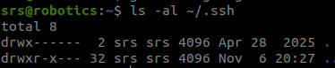
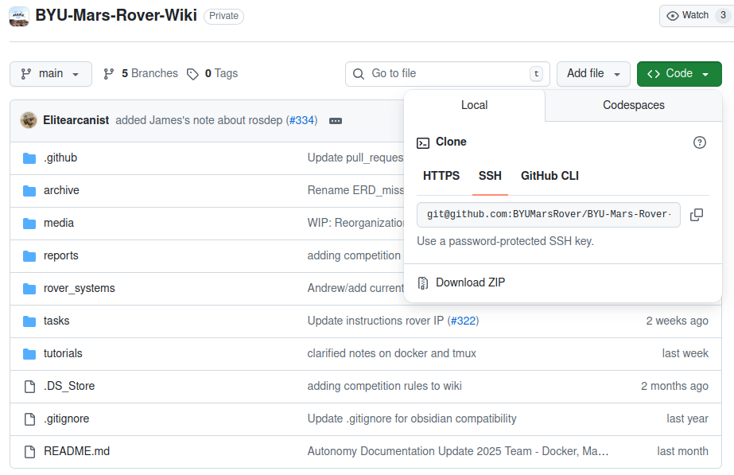
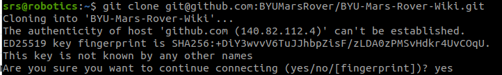
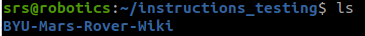

# Setting Up Git and SSH for Private Repository Access

### These instructions will help you:  
1. Install Git (an advanced file manager for programming projects).
2. Configure Git on your device.
3. Create an SSH key.
4. Link that SSH key with your Github account.
5. Download (clone) a repository from GitHub to your local computer.


<p style="text-align: center;">Flowchart<p>

### You will need:
- A computer that you have admin rights over.
- A POSIX-compliant terminal (such as Git Bash, your default Linux or Mac terminal, or WSL).
- A web browser.
- A Github account.

> [!NOTE]
>   **Tips for Using the Terminal**
> - Some commands may not produce any visible output — this is normal.  
> - If you are asked something like *“Do you want to continue?”*, type **Y** (or **yes**) and press **Enter**.  
> - To **copy** in a terminal, use **Ctrl + Shift + C**.  
> - To **paste**, use **Ctrl + Shift + V**.  
> - For more shortcuts, see [this guide](https://gist.github.com/bradtraversy/cc180de0edee05075a6139e42d5f28ce).

---

## 1. Install Git


<p style="text-align: center;">Flowchart Step 1<p>

- Open the terminal (`Ctrl + Alt + T`).
- Run
```bash
sudo apt update
```
- Run
```bash
sudo apt install git
```
---

## 2. Configure Git


<p style="text-align: center;">Flowchart Step 2<p>

Run the following commands, replacing `"Your Name"` and `"your.email@example.com"` with your own name and email:
```bash
git config --global user.name "Your Name"
git config --global user.email "your.email@example.com"
```

---

## 3. Set up an SSH key


<p style="text-align: center;">Flowchart Step 3<p>

* Check for existing SSH keys with `ls -al ~/.ssh`.
> [!NOTE]
> If the output has `id_ed25519`, then you already have an SSH key and can skip to Step 4.

<div style="text-align: center;" >

<p style="text-align: center;">Figure 1<p>
</div>

* If no key is found, generate one using:

  ```bash
  ssh-keygen -t ed25519 -C "your.email@example.com"
  ```
> [!NOTE]
> You will be prompted to enter a file to save the key to. The default is recommended and can be chosen by simply pressing Enter.
> You will also be asked to give a passphrase. You can skip the passphrase by pressing Enter twice more.
> You will then be shown the SSH-key fingerprint and a “randomart” image — these are saved automatically.

<div style="text-align: center;" >

<p style="text-align: center;">Figure 2<p>
</div>

---

## 4. Add your SSH key to your GitHub account


<p style="text-align: center;">Flowchart Step 4<p>

* Run the following command to display the SSH key:
  ```bash
  cat ~/.ssh/id_ed25519.pub
  ```

<div style="text-align: center;" >

<p style="text-align: center;">Figure 3<p>
</div>

* Copy the output, including the leading `ssh-ed25519` and your email.
  - Example of the output to copy: `ssh-ed25519 AAAAC3NzaC1lZDI1NTE5AAAAIJBJnxcw14qSzYlvnGDmllVmep6ITUj/iyLgGh9fC5z7 esmit@byu.edu`
* Open [Github](github.com) in your browser.
* In the top-right corner, click your profile photo → **Settings**.

<div style="text-align: center;" >

<p style="text-align: center;">Figure 4<p>
</div>

* In the sidebar, click **SSH and GPG keys**.

<div style="text-align: center;" >

<p style="text-align: center;">Figure 5<p>
</div>

* Click **New SSH key** or **Add SSH key**.

<div style="text-align: center;" >

<p style="text-align: center;">Figure 6<p>
</div>

* Paste your key into the “Key” field.
* Give it a descriptive title (e.g., *Laptop SSH Key*).
* Click **Add SSH key**.
> [!NOTE]
> Authentication may be required to confirm your identity before the key can be uploaded.

---

## 5. Clone the repository


<p style="text-align: center;">Flowchart Step 5<p>

* Go to the GitHub repository you want to clone.
* Click the green **Code** button, then select **SSH**.

<div style="text-align: center;" >

<p style="text-align: center;">Figure 7<p>
</div>

* Copy the given URL to your clipboard and return to the terminal.
* Run `git clone <YOUR_REPOSITORY_SSH_URL>`, replacing `URL` with the SSH link you copied.  
* Example:
```bash
  git clone git@github.com:BYUMarsRover/BYU-Mars-Rover-Wiki.git
```
> [!NOTE]
> You may see a warning asking if you want to trust GitHub. Reply with `yes`.
> <div style="text-align: center;" >
> 
> <p style="text-align: center;">Figure 8<p>
> </div>
#

**Congratulations!** You have successfully cloned the repository onto your computer.

To verify that the repository was cloned correctly:  
- Open the terminal.  
- Run `ls` and check for the repository folder.  
- If the folder appears, the repository has been successfully cloned.

<div style="text-align: center;" >

<p style="text-align: center;">Figure 9<p>
</div>

For any additional repositories, simply repeat **Step 5** to clone them.

